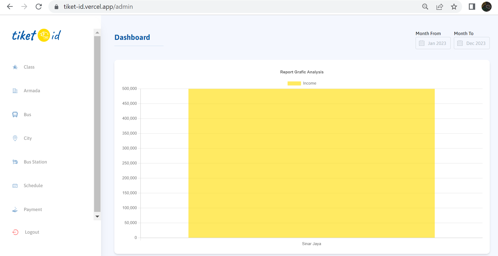

# Ticket-Order

```bash
Kelompok 1      : - Muhammad Akbar - 312110483
                  - Ridho Pikriyansyah - 312110169
                  - Rifky Abdillah Hasan -312110164
                  - Indi Alya Putri - 312110137
                  - Raihan Herfiansyah - 312110245
                  - Ekky Mandala Aji - 312110535
Tugas           : Project Akhir Pemograman Web 2
Judul Project   : Database Penjualan Tiket Bus
Kelas           : TI.21.A3
Mata Kuliah     : Pemograman Web 2
Dosen           : Agung Nugroho,S.Kom.,M.Kom
```

</br></br>

 <a href="[https://tiket-id.vercel.app)">

<div align="center">    
  
  </a>
  <h2 style="font-size:30px;" align="center"><strong>Ticket-Id</strong></h2>
  <p align="center">
    <a href="https://github.com/Akbaroke/Chichat/issues">Report Bug</a>
    ·
    <a href="https://github.com/Akbaroke/Chichat/issues">Request Feature</a>
  </p>

</div>

## About App

Ticket-id is an online platform application that provides bus ticket booking services.
<br/>
"Enjoy Your Seamless Bus Ticketing Experience!"

<br/>

## Tech Stack

- Reactjs Vite
- TailwindCss
- CI4
- MySql


<br/>

## Features

- Find Schedule
- Select Schedule
- Select seat
- Buy a ticket
- Payment

<br/>

## Dashboard Khusus Admin
  
  </a>
<br/>

## Dashboard User
  
  </a>
  <br/>

## Relasi db
 
  </a>
  <br/>
  
## Links

- Web : https://tiket-id.vercel.app
- Repo : [https://github.com/Akbaroke/Chichat](https://github.com/Akbaroke/ticket-order)
- Demo application : https://youtu.be/ezXZccs3d8A


