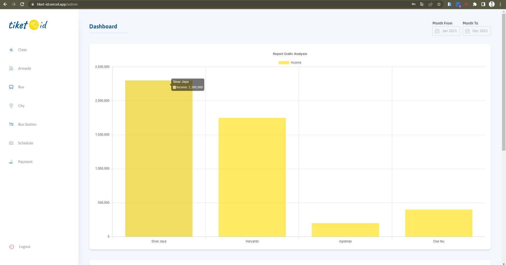
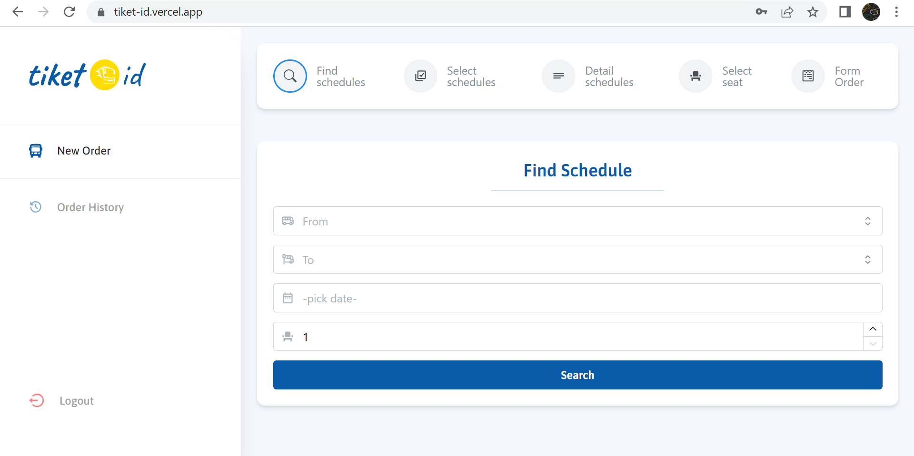
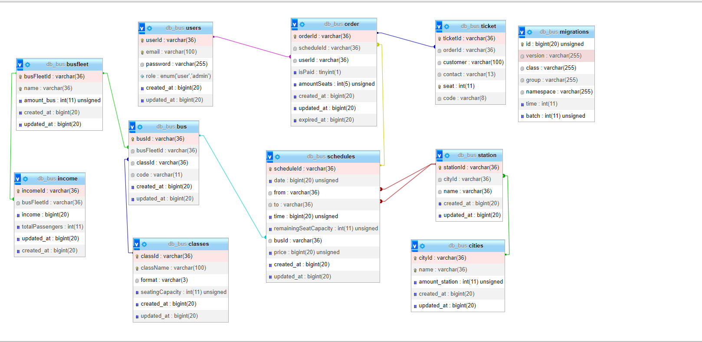

<div align="center">
  <a href="https://tiket-id.vercel.app" target="_blank">
    
  </a>
  <h2 style="font-size:30px;" align="center"><strong>Tiket Bus Id</strong></h2>
  <p align="center">
    <a href="https://github.com/Akbaroke/ticket-order/issues">Report Bug</a>
    ·
    <a href="https://github.com/Akbaroke/ticket-order/issues">Request Feature</a>
  </p>

</div>

<br/>

```
Tugas           : Project Akhir Pemograman Web 2

Judul Project   : Database Penjualan Tiket Bus

Kelas           : TI.21.A3

Mata Kuliah     : Pemograman Web 2

Dosen           : Agung Nugroho,S.Kom.,M.Kom

Kelompok 1      : • Muhammad Akbar (312110483) - Frontend Development
                  • Ridho Pikriyansyah (312110169) - Backend Development
                  • Rifky Abdillah Hasan (312110164) - Design Ui dan Logo
                  • Indi Alya Putri (312110137) - Documentasi dan Readme
                  • Raihan Herfiansyah (312110245) - Demo Aplikasi
                  • Ekky Mandala Aji (312110535) - Pembelian Hosting
```
<br/>

## About App

Aplikasi Pemesanan Tiket Bis adalah sebuah platform web yang memudahkan pengguna untuk memesan tiket perjalanan menggunakan bis dengan nyaman dan efisien. Aplikasi ini menyediakan berbagai fitur yang memungkinkan pengguna untuk melakukan pemesanan tiket, memilih tempat duduk yang diinginkan, serta memberikan kemudahan dalam mengatur dan mengelola aspek bisnis transportasi.

Fitur Utama:

Pemesanan Tiket: <br> Pengguna dapat melakukan pemesanan tiket bis melalui aplikasi ini. Mereka dapat memilih tujuan perjalanan, tanggal keberangkatan, jumlah penumpang, dan kelas perjalanan yang diinginkan.

Pemilihan Tempat Duduk: <br>Aplikasi ini memungkinkan pengguna untuk memilih tempat duduk sesuai dengan preferensi mereka. Mereka dapat melihat tampilan visual dari bus beserta nomor-nomor tempat duduk yang tersedia dan memilih tempat duduk yang mereka inginkan.

Menu Admin: <br>Aplikasi ini dilengkapi dengan menu admin yang memudahkan pengelola untuk mengatur dan mengelola aspek bisnis transportasi. Menu admin mencakup fitur-fitur berikut:

- Tambah Kelas: Pengelola dapat menambahkan kelas perjalanan yang berbeda sesuai dengan kebutuhan dan preferensi pengguna. Mereka dapat mengatur harga, ketersediaan tempat duduk, dan fasilitas yang tersedia di setiap kelas.

- Tambah Armada dan Bus: Pengelola dapat menambahkan armada dan bus baru ke dalam sistem. Mereka dapat memasukkan informasi seperti nomor bus, kapasitas penumpang, fasilitas yang disediakan, dan foto bus.

- Jadwal: Pengelola dapat mengatur jadwal keberangkatan dan kedatangan untuk setiap rute perjalanan. Mereka dapat mengelola waktu, harga tiket, dan armada yang akan digunakan.

- Terminal: Pengelola dapat menambahkan informasi tentang terminal-tempat keberangkatan dan tujuan perjalanan. Mereka dapat menyediakan informasi penting seperti alamat, nomor kontak, dan fasilitas yang tersedia di setiap terminal.

- Grafik Analisis Pendapatan: Aplikasi ini menyediakan grafik dan laporan analisis pendapatan dari setiap armada bus. Pengelola dapat melihat dan menganalisis performa bisnis dari masing-masing armada untuk mengambil keputusan yang lebih baik dalam pengelolaan bisnis transportasi.

Aplikasi Pemesanan Tiket Bis ini dirancang untuk memberikan kemudahan dan kenyamanan kepada pengguna dalam melakukan pemesanan tiket bis. Dengan fitur-fitur yang lengkap dan menu admin yang efisien, pengelola bisnis transportasi dapat dengan mudah mengelola dan mengoptimalkan operasional mereka.

<br/>

## Tech Stack

- Reactjs Vite
- TailwindCss
- CI4
- MySql


<br/>

## Features

- Find Schedule
- Select Schedule
- Select seat
- Buy a ticket
- Payment

<br/>

## Dashboard Admin
  
<br/>

## Dashboard User
  

<br/>

## Relasi Database
 


<br/>
  
## Links

- Web : https://tiket-id.vercel.app
- Repo : https://github.com/Akbaroke/ticket-order
- Demo : https://youtu.be/ezXZccs3d8A
